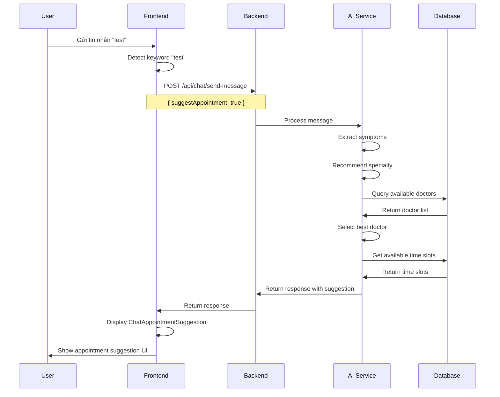

# 🏥 Appointment Suggestion API Specification

## 📋 Tổng quan

Specification cho API gợi ý lịch hẹn khi bệnh nhân chat với AI. Khi user gửi tin nhắn chứa từ khóa "test", backend sẽ trả về gợi ý lịch hẹn với bác sĩ phù hợp.

---

## 🎯 Trigger Logic

### 1. Frontend Trigger Conditions

#### **Keyword Detection**
```typescript
// Frontend sẽ detect các keywords sau:
const APPOINTMENT_KEYWORDS = [
  'test',           // Test keyword
  'khám',           // Khám bệnh
  'lịch hẹn',       // Đặt lịch hẹn
  'đặt lịch',       // Đặt lịch
  'bác sĩ',         // Tìm bác sĩ
  'tư vấn',         // Tư vấn y tế
  'triệu chứng',    // Có triệu chứng
  'đau',            // Đau đớn
  'sốt',            // Sốt
  'ho',             // Ho
  'mệt mỏi',        // Mệt mỏi
  'tái khám',       // Tái khám
  'khám lại',       // Khám lại
  'hẹn lại',        // Hẹn lại
  'lịch tái khám',  // Lịch tái khám
  'khi nào khám',   // Hỏi lịch khám
  'bao giờ khám',   // Hỏi thời gian khám
  'có cần khám',    // Hỏi có cần khám không
  'có nên khám'     // Hỏi có nên khám không
]

// Logic detect trong frontend:
const shouldTriggerAppointmentSuggestion = (message: string) => {
  const lowerMessage = message.toLowerCase()
  return APPOINTMENT_KEYWORDS.some(keyword => 
    lowerMessage.includes(keyword)
  )
}

// Detect follow-up appointment keywords
const shouldTriggerFollowUpSuggestion = (message: string) => {
  const followUpKeywords = [
    'tái khám', 'khám lại', 'hẹn lại', 'lịch tái khám',
    'khi nào khám', 'bao giờ khám', 'có cần khám', 'có nên khám'
  ]
  const lowerMessage = message.toLowerCase()
  return followUpKeywords.some(keyword => 
    lowerMessage.includes(keyword)
  )
}
```

#### **Frontend Implementation**
```typescript
// Trong ChatView component
const handleSendMessage = async (message: string, imageUrls?: string[]) => {
  // Detect keyword
  const shouldSuggest = shouldTriggerAppointmentSuggestion(message)
  const isFollowUp = shouldTriggerFollowUpSuggestion(message)
  
  // Gửi lên API với flag
  const response = await sendMessageToAI(
    selectedConversationId,
    message,
    user?._id || '',
    imageUrls,
    {
      suggestAppointment: shouldSuggest,
      isFollowUpAppointment: isFollowUp,
      userSymptoms: extractSymptoms(message), // Optional
      preferredSpecialty: extractSpecialty(message), // Optional
      urgency: detectUrgency(message) // Optional
    }
  )
  
  // Hiển thị suggestion nếu có
  if (response.appointmentSuggestion) {
    // UI sẽ tự động hiển thị ChatAppointmentSuggestion
    showAppointmentConfirmation(response.appointmentSuggestion)
  }
}

// Helper function để detect urgency
const detectUrgency = (message: string): 'normal' | 'urgent' | 'emergency' => {
  const urgentKeywords = ['khẩn cấp', 'gấp', 'ngay', 'cấp cứu']
  const emergencyKeywords = ['cấp cứu', 'nguy hiểm', 'tình trạng xấu']
  
  const lowerMessage = message.toLowerCase()
  
  if (emergencyKeywords.some(keyword => lowerMessage.includes(keyword))) {
    return 'emergency'
  }
  
  if (urgentKeywords.some(keyword => lowerMessage.includes(keyword))) {
    return 'urgent'
  }
  
  return 'normal'
}
```

---

## 🔧 Backend API Specification

### 1. Request Format

#### **POST /api/chat/send-message**

```json
{
  "conversationId": "conv_123",
  "message": "Tôi muốn test khám bệnh",
  "userId": "user_456",
  "imageUrls": [],
  "options": {
    "suggestAppointment": true,
    "isFollowUpAppointment": false,
    "userSymptoms": ["đau đầu", "mệt mỏi"],
    "preferredSpecialty": "nội khoa",
    "urgency": "normal", // normal, urgent, emergency
    "lastAppointmentId": "appt_789", // For follow-up appointments
    "preferredDate": "2024-01-25", // Optional
    "preferredTime": "14:00" // Optional
  }
}
```

### 2. Response Format

#### **Success Response (200)**

```json
{
  "success": true,
  "data": {
    "reply": "Tôi hiểu bạn muốn khám bệnh. Dựa trên triệu chứng của bạn, tôi gợi ý bạn nên khám với bác sĩ nội khoa.",
    "appointmentSuggestion": {
      "type": "new_appointment", // new_appointment, follow_up, emergency
      "doctorId": "doc_789",
      "doctorName": "BS. Nguyễn Văn A",
      "doctorAvatar": "https://example.com/avatar.jpg",
      "doctorSpecialty": "Nội khoa",
      "suggestedDate": "2024-01-20",
      "suggestedTime": "14:00",
      "reason": "Khám tổng quát và tư vấn sức khỏe",
      "estimatedDuration": 30,
      "location": "Phòng khám 101 - Tầng 1",
      "price": 500000,
      "isFollowUp": false,
      "lastAppointmentId": null,
      "followUpReason": null,
      "availableSlots": [
        {
          "date": "2024-01-20",
          "time": "14:00",
          "available": true
        },
        {
          "date": "2024-01-20", 
          "time": "15:00",
          "available": true
        }
      ],
      "alternativeDoctors": [
        {
          "doctorId": "doc_790",
          "doctorName": "BS. Trần Thị B",
          "doctorSpecialty": "Nội khoa",
          "nextAvailable": "2024-01-21T09:00:00Z"
        }
      ],
      "confirmationRequired": true,
      "confirmationMessage": "Bạn có muốn đặt lịch hẹn này không?"
    }
  }
}
```

#### **Follow-up Appointment Response (200)**

```json
{
  "success": true,
  "data": {
    "reply": "Dựa trên lịch sử khám bệnh của bạn, tôi gợi ý bạn nên tái khám sau 2 tuần để theo dõi tình trạng sức khỏe.",
    "appointmentSuggestion": {
      "type": "follow_up",
      "doctorId": "doc_789",
      "doctorName": "BS. Nguyễn Văn A",
      "doctorAvatar": "https://example.com/avatar.jpg",
      "doctorSpecialty": "Nội khoa",
      "suggestedDate": "2024-02-03",
      "suggestedTime": "10:00",
      "reason": "Tái khám theo dõi tình trạng sức khỏe",
      "estimatedDuration": 20,
      "location": "Phòng khám 101 - Tầng 1",
      "price": 300000,
      "isFollowUp": true,
      "lastAppointmentId": "appt_789",
      "followUpReason": "Theo dõi tình trạng sau điều trị",
      "availableSlots": [
        {
          "date": "2024-02-03",
          "time": "10:00",
          "available": true
        },
        {
          "date": "2024-02-03",
          "time": "11:00",
          "available": true
        }
      ],
      "alternativeDoctors": [],
      "confirmationRequired": true,
      "confirmationMessage": "Bạn có muốn đặt lịch tái khám này không?"
    }
  }
}
```

#### **Response without Suggestion (200)**

```json
{
  "success": true,
  "data": {
    "reply": "Xin chào! Tôi có thể giúp gì cho bạn?",
    "appointmentSuggestion": null
  }
}
```

---

## 📊 Data Structure

### 1. AppointmentSuggestion Object

```typescript
interface AppointmentSuggestion {
  // Appointment Type
  type: 'new_appointment' | 'follow_up' | 'emergency'  // Loại lịch hẹn
  
  // Doctor Information
  doctorId: string                    // ID bác sĩ
  doctorName: string                  // Tên bác sĩ
  doctorAvatar?: string               // Avatar bác sĩ
  doctorSpecialty: string             // Chuyên khoa
  doctorRating?: number               // Đánh giá bác sĩ (1-5)
  doctorExperience?: string           // Kinh nghiệm
  
  // Appointment Details
  suggestedDate: string               // Ngày gợi ý (YYYY-MM-DD)
  suggestedTime: string               // Giờ gợi ý (HH:MM)
  reason: string                      // Lý do khám
  estimatedDuration: number           // Thời gian dự kiến (phút)
  
  // Follow-up Information
  isFollowUp: boolean                 // Có phải tái khám không
  lastAppointmentId?: string          // ID lịch hẹn trước đó
  followUpReason?: string             // Lý do tái khám
  
  // Location & Price
  location?: string                   // Địa điểm khám
  price?: number                      // Giá khám (VNĐ)
  
  // Additional Options
  availableSlots?: Array<{            // Các slot khác có sẵn
    date: string
    time: string
    available: boolean
  }>
  
  alternativeDoctors?: Array<{        // Bác sĩ thay thế
    doctorId: string
    doctorName: string
    doctorSpecialty: string
    nextAvailable: string
  }>
  
  // Confirmation
  confirmationRequired: boolean       // Có cần xác nhận không
  confirmationMessage: string         // Thông báo xác nhận
  
  // Metadata
  confidence?: number                 // Độ tin cậy gợi ý (0-1)
  generatedAt: string                // Thời gian tạo gợi ý
  expiresAt?: string                 // Thời gian hết hạn gợi ý
}
```

### 2. Request Options

```typescript
interface ChatOptions {
  suggestAppointment?: boolean        // Có gợi ý lịch hẹn không
  isFollowUpAppointment?: boolean     // Có phải tái khám không
  userSymptoms?: string[]            // Triệu chứng của user
  preferredSpecialty?: string        // Chuyên khoa ưa thích
  urgency?: 'normal' | 'urgent' | 'emergency'  // Mức độ khẩn cấp
  lastAppointmentId?: string         // ID lịch hẹn trước đó (cho tái khám)
  preferredDate?: string             // Ngày ưa thích
  preferredTime?: string             // Giờ ưa thích
  location?: string                  // Địa điểm ưa thích
  budget?: number                    // Ngân sách
}
```

---

## 🤖 AI Logic Specification

### 1. Keyword Detection

```python
# Backend keyword detection
APPOINTMENT_KEYWORDS = [
    'test', 'khám', 'lịch hẹn', 'đặt lịch', 'bác sĩ', 'tư vấn',
    'triệu chứng', 'đau', 'sốt', 'ho', 'mệt mỏi', 'buồn nôn',
    'chóng mặt', 'khó thở', 'đau ngực', 'đau bụng'
]

def should_suggest_appointment(message: str) -> bool:
    """Kiểm tra có nên gợi ý lịch hẹn không"""
    message_lower = message.lower()
    return any(keyword in message_lower for keyword in APPOINTMENT_KEYWORDS)
```

### 2. Symptom Extraction

```python
def extract_symptoms(message: str) -> List[str]:
    """Trích xuất triệu chứng từ tin nhắn"""
    symptoms = []
    
    symptom_keywords = {
        'đau đầu': ['đau đầu', 'nhức đầu', 'đau đầu'],
        'sốt': ['sốt', 'nóng', 'fever'],
        'ho': ['ho', 'cough'],
        'mệt mỏi': ['mệt mỏi', 'mệt', 'yếu'],
        'đau bụng': ['đau bụng', 'đau dạ dày'],
        'khó thở': ['khó thở', 'thở khó'],
        'chóng mặt': ['chóng mặt', 'hoa mắt']
    }
    
    message_lower = message.lower()
    for symptom, keywords in symptom_keywords.items():
        if any(keyword in message_lower for keyword in keywords):
            symptoms.append(symptom)
    
    return symptoms
```

### 3. Specialty Recommendation

```python
def recommend_specialty(symptoms: List[str]) -> str:
    """Gợi ý chuyên khoa dựa trên triệu chứng"""
    specialty_mapping = {
        'đau đầu': 'thần kinh',
        'sốt': 'nội khoa',
        'ho': 'hô hấp',
        'đau bụng': 'tiêu hóa',
        'khó thở': 'hô hấp',
        'chóng mặt': 'thần kinh'
    }
    
    for symptom in symptoms:
        if symptom in specialty_mapping:
            return specialty_mapping[symptom]
    
    return 'nội khoa'  # Default
```

### 4. Doctor Selection

```python
def select_doctor(specialty: str, urgency: str = 'normal') -> dict:
    """Chọn bác sĩ phù hợp"""
    # Query database để tìm bác sĩ
    doctors = Doctor.objects.filter(
        specialty=specialty,
        is_active=True,
        is_available=True
    ).order_by('-rating', 'next_available')
    
    if not doctors.exists():
        # Fallback to general medicine
        doctors = Doctor.objects.filter(
            specialty='nội khoa',
            is_active=True
        ).order_by('-rating')
    
    selected_doctor = doctors.first()
    
    return {
        'doctorId': selected_doctor.id,
        'doctorName': selected_doctor.name,
        'doctorAvatar': selected_doctor.avatar_url,
        'doctorSpecialty': selected_doctor.specialty,
        'doctorRating': selected_doctor.rating
    }
```

### 5. Time Slot Generation

```python
def generate_time_slots(doctor_id: str, days_ahead: int = 7) -> List[dict]:
    """Tạo danh sách time slots có sẵn"""
    from datetime import datetime, timedelta
    
    slots = []
    base_date = datetime.now()
    
    for i in range(days_ahead):
        date = base_date + timedelta(days=i)
        date_str = date.strftime('%Y-%m-%d')
        
        # Lấy available slots cho ngày này
        available_times = get_available_slots(doctor_id, date_str)
        
        for time_slot in available_times:
            slots.append({
                'date': date_str,
                'time': time_slot,
                'available': True
            })
    
    return slots[:10]  # Limit to 10 slots
```

### 6. Follow-up Appointment Logic

```python
def handle_follow_up_appointment(user_id: str, message: str) -> dict:
    """Xử lý logic tái khám"""
    # Lấy lịch sử khám bệnh của user
    last_appointments = get_user_appointments(user_id, limit=5)
    
    if not last_appointments:
        return {
            'type': 'new_appointment',
            'reason': 'Khám tổng quát',
            'isFollowUp': False
        }
    
    # Lấy lịch hẹn gần nhất
    last_appointment = last_appointments[0]
    
    # Kiểm tra thời gian từ lần khám cuối
    days_since_last = (datetime.now() - last_appointment.date).days
    
    # Logic gợi ý tái khám
    if days_since_last >= 14:  # Sau 2 tuần
        return {
            'type': 'follow_up',
            'isFollowUp': True,
            'lastAppointmentId': last_appointment.id,
            'followUpReason': 'Tái khám theo dõi tình trạng sức khỏe',
            'suggestedDate': calculate_follow_up_date(last_appointment.date),
            'doctorId': last_appointment.doctor_id,
            'reason': f'Tái khám sau {days_since_last} ngày'
        }
    elif days_since_last >= 7:  # Sau 1 tuần
        return {
            'type': 'follow_up',
            'isFollowUp': True,
            'lastAppointmentId': last_appointment.id,
            'followUpReason': 'Tái khám theo dõi tiến triển',
            'suggestedDate': calculate_follow_up_date(last_appointment.date),
            'doctorId': last_appointment.doctor_id,
            'reason': f'Tái khám theo dõi sau {days_since_last} ngày'
        }
    else:
        return {
            'type': 'new_appointment',
            'reason': 'Khám mới',
            'isFollowUp': False
        }

def calculate_follow_up_date(last_appointment_date: datetime) -> str:
    """Tính toán ngày tái khám phù hợp"""
    # Thêm 2 tuần từ ngày khám cuối
    follow_up_date = last_appointment_date + timedelta(days=14)
    
    # Đảm bảo không rơi vào cuối tuần
    while follow_up_date.weekday() >= 5:  # 5=Saturday, 6=Sunday
        follow_up_date += timedelta(days=1)
    
    return follow_up_date.strftime('%Y-%m-%d')

def get_user_appointments(user_id: str, limit: int = 5) -> List[dict]:
    """Lấy lịch sử khám bệnh của user"""
    appointments = Appointment.objects.filter(
        user_id=user_id,
        status='completed'
    ).order_by('-date')[:limit]
    
    return [
        {
            'id': apt.id,
            'date': apt.date,
            'doctor_id': apt.doctor_id,
            'doctor_name': apt.doctor.name,
            'specialty': apt.doctor.specialty,
            'reason': apt.reason
        }
        for apt in appointments
    ]
```

---

## 🔄 API Flow

### 1. Complete Flow



### 2. Error Handling

```json
// Error Response
{
  "success": false,
  "error": {
    "code": "NO_DOCTORS_AVAILABLE",
    "message": "Không có bác sĩ phù hợp trong thời gian này",
    "details": {
      "suggestedAlternative": "Vui lòng thử lại sau 2-3 ngày",
      "contactInfo": "Hotline: 1900-xxxx"
    }
  }
}
```

---

## 🧪 Testing Scenarios

### 1. Test Cases

#### **Test Case 1: Basic Keyword Detection**
```json
// Input
{
  "message": "test",
  "options": { "suggestAppointment": true }
}

// Expected Output
{
  "reply": "Tôi hiểu bạn muốn test khám bệnh...",
  "appointmentSuggestion": { /* suggestion object */ }
}
```

#### **Test Case 2: Symptom-based Suggestion**
```json
// Input
{
  "message": "Tôi bị đau đầu và sốt",
  "options": { "suggestAppointment": true }
}

// Expected Output
{
  "reply": "Dựa trên triệu chứng đau đầu và sốt...",
  "appointmentSuggestion": {
    "doctorSpecialty": "nội khoa",
    "reason": "Khám triệu chứng đau đầu và sốt"
  }
}
```

#### **Test Case 3: Follow-up Appointment**
```json
// Input
{
  "message": "Tôi muốn tái khám",
  "options": { 
    "suggestAppointment": true,
    "isFollowUpAppointment": true,
    "lastAppointmentId": "appt_789"
  }
}

// Expected Output
{
  "reply": "Dựa trên lịch sử khám bệnh của bạn, tôi gợi ý bạn nên tái khám sau 2 tuần để theo dõi tình trạng sức khỏe.",
  "appointmentSuggestion": {
    "type": "follow_up",
    "isFollowUp": true,
    "lastAppointmentId": "appt_789",
    "followUpReason": "Tái khám theo dõi tình trạng sức khỏe",
    "doctorId": "doc_789",
    "suggestedDate": "2024-02-03",
    "confirmationRequired": true
  }
}
```

#### **Test Case 4: No Suggestion**
```json
// Input
{
  "message": "Xin chào",
  "options": { "suggestAppointment": false }
}

// Expected Output
{
  "reply": "Xin chào! Tôi có thể giúp gì cho bạn?",
  "appointmentSuggestion": null
}
```

### 2. Edge Cases

- **No doctors available**: Trả về alternative doctors
- **Invalid specialty**: Fallback to general medicine
- **No symptoms detected**: Suggest general checkup
- **Emergency keywords**: Prioritize urgent care
- **No appointment history**: Suggest new appointment
- **Recent appointment**: Suggest follow-up based on time
- **Confirmation rejected**: Log rejection and suggest alternatives

---

## 📱 Frontend Integration

### 1. Component Usage

```typescript
// ChatMessageItem sẽ tự động render ChatAppointmentSuggestion
{!isCurrentUser && message.appointmentSuggestion && (
  <Box sx={{ mt: 1.5 }}>
    <ChatAppointmentSuggestion
      suggestion={message.appointmentSuggestion}
      onAccept={onAppointmentAccept}
      onReject={onAppointmentReject}
      onConfirm={onAppointmentConfirm}
    />
  </Box>
)}
```

### 2. Confirmation Dialog Component

```typescript
// ChatAppointmentConfirmation.tsx
interface ChatAppointmentConfirmationProps {
  suggestion: AppointmentSuggestion
  onConfirm: (confirmed: boolean) => void
  onClose: () => void
}

const ChatAppointmentConfirmation: React.FC<ChatAppointmentConfirmationProps> = ({
  suggestion,
  onConfirm,
  onClose
}) => {
  const handleConfirm = () => {
    onConfirm(true)
    onClose()
  }

  const handleReject = () => {
    onConfirm(false)
    onClose()
  }

  return (
    <Dialog open={true} onClose={onClose} maxWidth="sm" fullWidth>
      <DialogTitle>
        {suggestion.isFollowUp ? 'Xác nhận lịch tái khám' : 'Xác nhận lịch hẹn'}
      </DialogTitle>
      <DialogContent>
        <Box sx={{ mb: 2 }}>
          <Typography variant="h6" gutterBottom>
            {suggestion.doctorName}
          </Typography>
          <Typography variant="body2" color="text.secondary">
            {suggestion.doctorSpecialty}
          </Typography>
        </Box>
        
        <Box sx={{ mb: 2 }}>
          <Typography variant="body1">
            <strong>Ngày:</strong> {formatDate(suggestion.suggestedDate)}
          </Typography>
          <Typography variant="body1">
            <strong>Giờ:</strong> {suggestion.suggestedTime}
          </Typography>
          <Typography variant="body1">
            <strong>Lý do:</strong> {suggestion.reason}
          </Typography>
          {suggestion.followUpReason && (
            <Typography variant="body1">
              <strong>Tái khám vì:</strong> {suggestion.followUpReason}
            </Typography>
          )}
          <Typography variant="body1">
            <strong>Giá:</strong> {formatPrice(suggestion.price)}
          </Typography>
        </Box>

        <Typography variant="body2" color="text.secondary">
          {suggestion.confirmationMessage}
        </Typography>
      </DialogContent>
      <DialogActions>
        <Button onClick={handleReject} color="secondary">
          Từ chối
        </Button>
        <Button onClick={handleConfirm} variant="contained" color="primary">
          Xác nhận
        </Button>
      </DialogActions>
    </Dialog>
  )
}
```

### 3. State Management

```typescript
// ChatView state
const [appointmentSuggestions, setAppointmentSuggestions] = useState<Map<string, AppointmentSuggestion>>(new Map())
const [showConfirmation, setShowConfirmation] = useState(false)
const [currentSuggestion, setCurrentSuggestion] = useState<AppointmentSuggestion | null>(null)

// Handle new suggestion
const handleNewSuggestion = (messageId: string, suggestion: AppointmentSuggestion) => {
  setAppointmentSuggestions(prev => new Map(prev.set(messageId, suggestion)))
  
  // Show confirmation dialog if required
  if (suggestion.confirmationRequired) {
    setCurrentSuggestion(suggestion)
    setShowConfirmation(true)
  }
}

// Handle confirmation
const handleAppointmentConfirm = async (confirmed: boolean) => {
  if (!currentSuggestion) return

  if (confirmed) {
    // Call API to create appointment
    try {
      await createAppointment({
        doctorId: currentSuggestion.doctorId,
        date: currentSuggestion.suggestedDate,
        time: currentSuggestion.suggestedTime,
        reason: currentSuggestion.reason,
        isFollowUp: currentSuggestion.isFollowUp,
        lastAppointmentId: currentSuggestion.lastAppointmentId
      })
      
      // Show success message
      showSuccessMessage('Đã đặt lịch hẹn thành công!')
    } catch (error) {
      showErrorMessage('Có lỗi xảy ra khi đặt lịch hẹn')
    }
  } else {
    // Show rejection message
    showInfoMessage('Bạn đã từ chối lịch hẹn này')
  }

  setShowConfirmation(false)
  setCurrentSuggestion(null)
}
```

### 4. Helper Functions

```typescript
// Helper functions for formatting
const formatDate = (dateString: string): string => {
  const date = new Date(dateString)
  return date.toLocaleDateString('vi-VN', {
    weekday: 'long',
    year: 'numeric',
    month: 'long',
    day: 'numeric'
  })
}

const formatPrice = (price?: number): string => {
  if (!price) return 'Miễn phí'
  return new Intl.NumberFormat('vi-VN', {
    style: 'currency',
    currency: 'VND'
  }).format(price)
}

// API call to create appointment
const createAppointment = async (appointmentData: {
  doctorId: string
  date: string
  time: string
  reason: string
  isFollowUp: boolean
  lastAppointmentId?: string
}) => {
  const response = await fetch('/api/appointments', {
    method: 'POST',
    headers: {
      'Content-Type': 'application/json',
      'Authorization': `Bearer ${getAuthToken()}`
    },
    body: JSON.stringify(appointmentData)
  })
  
  if (!response.ok) {
    throw new Error('Failed to create appointment')
  }
  
  return response.json()
}
```

---

## 🚀 Implementation Checklist

### Backend Tasks
- [ ] Implement keyword detection logic
- [ ] Create symptom extraction algorithm
- [ ] Build specialty recommendation system
- [ ] Implement doctor selection logic
- [ ] Create time slot generation
- [ ] Add follow-up appointment logic
- [ ] Implement appointment history lookup
- [ ] Add confirmation system
- [ ] Add error handling
- [ ] Write unit tests
- [ ] Add API documentation

### Frontend Tasks
- [ ] Update sendMessageToAI to include options
- [ ] Implement keyword detection for follow-up
- [ ] Update ChatView to handle suggestions
- [ ] Create ChatAppointmentConfirmation component
- [ ] Implement confirmation dialog
- [ ] Add appointment creation API call
- [ ] Test appointment suggestion UI
- [ ] Add error handling
- [ ] Update documentation

---

## 📞 Support

### Status
🔄 **IN PROGRESS** - Specification ready for implementation

### Next Steps
1. Backend team implement API logic with follow-up support
2. Frontend team update integration with confirmation dialog
3. Test with "test" keyword and follow-up keywords
4. Test confirmation flow
5. Deploy and monitor

---

> **Lưu ý**: Specification này cung cấp đầy đủ thông tin để backend và frontend implement tính năng gợi ý lịch hẹn khi user chat với AI.
