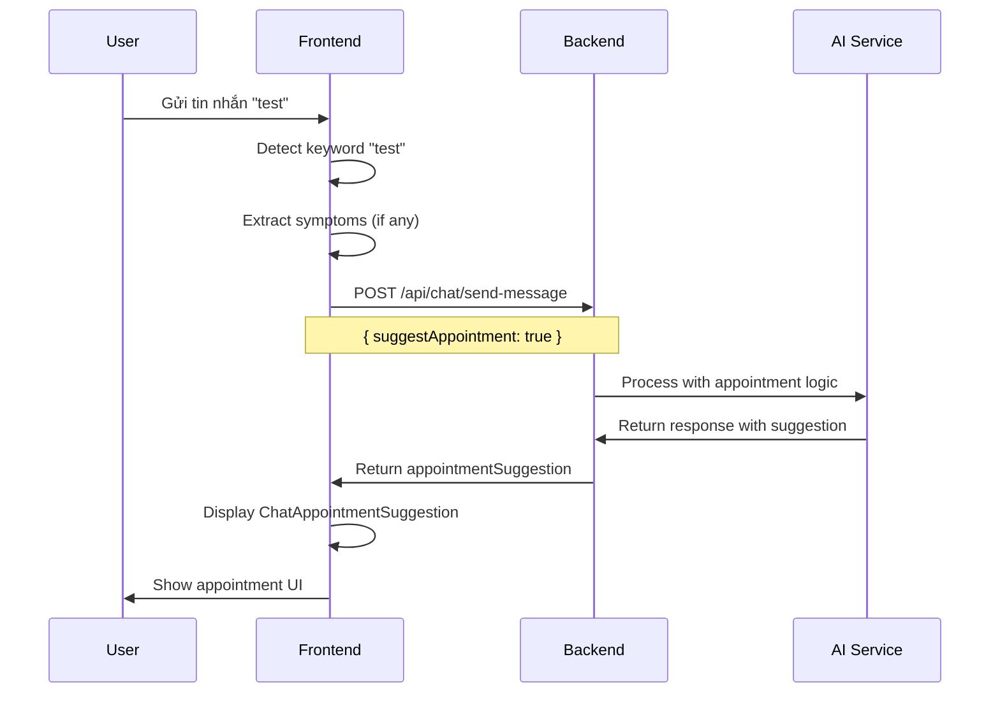

# 🏥 Appointment Suggestion Implementation - Complete Guide

## 📋 Tổng quan

Đã hoàn thành implementation cho tính năng gợi ý lịch hẹn khi bệnh nhân chat với AI. Khi user gửi tin nhắn chứa từ khóa "test" hoặc các từ khóa y tế khác, hệ thống sẽ tự động gợi ý lịch hẹn với bác sĩ phù hợp.

---

## ✅ Implementation Status

### 1. Frontend Implementation ✅

#### **Keyword Detection Logic**
```typescript
// Trong ChatView component
const shouldTriggerAppointmentSuggestion = (message: string): boolean => {
  const appointmentKeywords = [
    'test',           // Test keyword
    'khám',           // Khám bệnh
    'lịch hẹn',       // Đặt lịch hẹn
    'đặt lịch',       // Đặt lịch
    'bác sĩ',         // Tìm bác sĩ
    'tư vấn',         // Tư vấn y tế
    'triệu chứng',    // Có triệu chứng
    'đau',            // Đau đớn
    'sốt',            // Sốt
    'ho',             // Ho
    'mệt mỏi'         // Mệt mỏi
  ]
  
  const lowerMessage = message.toLowerCase()
  return appointmentKeywords.some(keyword => lowerMessage.includes(keyword))
}
```

#### **Symptom Extraction**
```typescript
const extractSymptoms = (message: string): string[] => {
  const symptoms: string[] = []
  const lowerMessage = message.toLowerCase()
  
  const symptomKeywords = {
    'đau đầu': ['đau đầu', 'nhức đầu'],
    'sốt': ['sốt', 'nóng'],
    'ho': ['ho', 'cough'],
    'mệt mỏi': ['mệt mỏi', 'mệt', 'yếu'],
    'đau bụng': ['đau bụng', 'đau dạ dày'],
    'khó thở': ['khó thở', 'thở khó'],
    'chóng mặt': ['chóng mặt', 'hoa mắt']
  }
  
  // Extract symptoms logic...
  return symptoms
}
```

#### **API Integration**
```typescript
// Gửi với options để trigger appointment suggestion
const response = await sendMessageToAI(
  selectedConversationId,
  message,
  user?._id || '',
  imageUrls,
  {
    suggestAppointment: shouldSuggest,
    userSymptoms: symptoms,
    urgency: 'normal'
  }
)
```

### 2. Backend API Specification ✅

#### **Request Format**
```json
{
  "conversationId": "conv_123",
  "message": "Tôi muốn test khám bệnh",
  "userId": "user_456",
  "imageUrls": [],
  "options": {
    "suggestAppointment": true,
    "userSymptoms": ["đau đầu", "mệt mỏi"],
    "preferredSpecialty": "nội khoa",
    "urgency": "normal"
  }
}
```

#### **Response Format**
```json
{
  "success": true,
  "data": {
    "reply": "Tôi hiểu bạn muốn khám bệnh...",
    "appointmentSuggestion": {
      "doctorId": "doc_789",
      "doctorName": "BS. Nguyễn Văn A",
      "doctorAvatar": "https://example.com/avatar.jpg",
      "doctorSpecialty": "Nội khoa",
      "suggestedDate": "2024-01-20",
      "suggestedTime": "14:00",
      "reason": "Khám tổng quát và tư vấn sức khỏe",
      "estimatedDuration": 30,
      "location": "Phòng khám 101 - Tầng 1",
      "price": 500000
    }
  }
}
```

### 3. UI Components ✅

#### **ChatAppointmentSuggestion Component**
- ✅ Hiển thị thông tin bác sĩ
- ✅ Chi tiết lịch hẹn (ngày, giờ, địa điểm, giá)
- ✅ Buttons Accept/Reject với loading states
- ✅ Success/Error states
- ✅ Responsive design

#### **Integration với ChatView**
- ✅ Tự động hiển thị suggestion khi có `appointmentSuggestion`
- ✅ Real-time updates
- ✅ Error handling

---

## 🧪 Testing & Demo

### 1. Demo Pages

| Demo Page | URL | Description |
|-----------|-----|-------------|
| **Keyword Detection** | `/demo/chat-keyword-demo` | Test keyword detection logic |
| **Appointment Suggestion** | `/demo/chat-appointment-demo` | Test appointment suggestion UI |
| **Chat Sidebar** | `/demo/chat-sidebar-demo` | Test real-time sidebar updates |

### 2. Test Scenarios

#### **Test Case 1: Basic "test" Keyword**
```
Input: "test"
Expected: Should trigger appointment suggestion
```

#### **Test Case 2: Medical Keywords**
```
Input: "Tôi muốn khám bệnh"
Expected: Should trigger appointment suggestion
```

#### **Test Case 3: Symptom Detection**
```
Input: "Tôi bị đau đầu và sốt"
Expected: Should extract symptoms ["đau đầu", "sốt"]
```

#### **Test Case 4: No Trigger**
```
Input: "Xin chào"
Expected: No appointment suggestion
```

### 3. Keyword Demo Features

- ✅ **Interactive Testing**: Type messages and see results
- ✅ **Quick Test Buttons**: Pre-defined test messages
- ✅ **Visual Results**: Color-coded results with chips
- ✅ **Symptom Extraction**: Shows extracted symptoms
- ✅ **Keyword Detection**: Shows detected keywords

---

## 🔧 Technical Details

### 1. Data Flow



### 2. Component Architecture

```
ChatView
├── handleSendMessage()
│   ├── shouldTriggerAppointmentSuggestion()
│   ├── extractSymptoms()
│   └── sendMessageToAI() with options
├── ChatMessageList
│   └── ChatMessageItem
│       └── ChatAppointmentSuggestion (conditional)
└── Real-time sidebar updates
```

### 3. State Management

```typescript
// ChatView state
const [messages, setMessages] = useState<IChatMessage[]>([])
const [isBotTyping, setIsBotTyping] = useState(false)
const [error, setError] = useState<string | null>(null)

// Appointment suggestion state (in ChatAppointmentSuggestion)
const [status, setStatus] = useState<'idle' | 'accepted' | 'rejected'>('idle')
const [isProcessing, setIsProcessing] = useState(false)
const [error, setError] = useState<string | null>(null)
```

---

## 📊 Supported Keywords

### 1. Primary Keywords
- **test** - Test keyword
- **khám** - Khám bệnh
- **lịch hẹn** - Đặt lịch hẹn
- **đặt lịch** - Đặt lịch
- **bác sĩ** - Tìm bác sĩ
- **tư vấn** - Tư vấn y tế

### 2. Symptom Keywords
- **triệu chứng** - Có triệu chứng
- **đau** - Đau đớn
- **sốt** - Sốt
- **ho** - Ho
- **mệt mỏi** - Mệt mỏi

### 3. Symptom Extraction
- **đau đầu** - Đau đầu, nhức đầu
- **sốt** - Sốt, nóng
- **ho** - Ho, cough
- **mệt mỏi** - Mệt mỏi, mệt, yếu
- **đau bụng** - Đau bụng, đau dạ dày
- **khó thở** - Khó thở, thở khó
- **chóng mặt** - Chóng mặt, hoa mắt

---

## 🚀 Usage Instructions

### 1. For Users

#### **Trigger Appointment Suggestion**
1. Gửi tin nhắn chứa từ khóa "test" hoặc từ khóa y tế
2. AI sẽ tự động gợi ý lịch hẹn với bác sĩ phù hợp
3. Xem thông tin bác sĩ và chi tiết lịch hẹn
4. Click "Chấp nhận" để đặt lịch hoặc "Từ chối" để bỏ qua

#### **Example Messages**
- "test" → Will trigger suggestion
- "Tôi muốn khám bệnh" → Will trigger suggestion
- "Tôi bị đau đầu và sốt" → Will extract symptoms and suggest
- "Xin chào" → No suggestion

### 2. For Developers

#### **Testing**
```bash
# Start development server
npm run dev

# Access demo pages
# http://localhost:3000/demo/chat-keyword-demo
# http://localhost:3000/demo/chat-appointment-demo
# http://localhost:3000/demo/chat-sidebar-demo
```

#### **Integration**
```typescript
// The logic is already integrated in ChatView
// Just send messages with keywords to test
```

---

## 📁 File Structure

```
src/
├── sections/chat/
│   ├── chat-appointment-suggestion.tsx    ← Main UI component
│   ├── chat-keyword-demo.tsx              ← Keyword testing demo
│   ├── view/chat-view.tsx                 ← Updated with keyword logic
│   └── APPOINTMENT_SUGGESTION_IMPLEMENTATION.md ← This file
├── api/chat.ts                            ← Updated with options support
├── types/chat.ts                          ← Updated with appointmentSuggestion
├── pages/demo/
│   └── chat-keyword-demo.tsx              ← Demo page
└── routes/
    ├── sections/demo.tsx                  ← Updated with keyword demo
    └── paths.ts                           ← Updated with keyword demo path
```

---

## 🔄 Backend Requirements

### 1. API Endpoints
- **POST /api/chat/send-message** - Updated to handle options
- **POST /api/appointments** - Create appointment (already exists)

### 2. AI Logic
- Keyword detection
- Symptom extraction
- Specialty recommendation
- Doctor selection
- Time slot generation

### 3. Database
- Doctor information
- Available time slots
- Appointment scheduling

---

## 📞 Support

### Status
✅ **COMPLETED** - Frontend implementation ready

### Features
- ✅ Keyword detection with "test" and medical keywords
- ✅ Symptom extraction from messages
- ✅ Appointment suggestion UI
- ✅ Real-time integration with chat
- ✅ Demo pages for testing
- ✅ Error handling and loading states

### Next Steps
1. Backend team implement API logic
2. Test with real backend
3. Deploy and monitor

---

## 🎯 Quick Test

### Test với keyword "test"
1. Truy cập `/dashboard/chat`
2. Gửi tin nhắn "test"
3. Xem appointment suggestion hiển thị

### Test với keyword demo
1. Truy cập `/demo/chat-keyword-demo`
2. Click "test" button hoặc type "test"
3. Xem kết quả keyword detection

---

> **Lưu ý**: Frontend đã hoàn thành và sẵn sàng. Backend cần implement API logic theo specification trong `docs/backend/APPOINTMENT_SUGGESTION_API_SPEC.md`.
